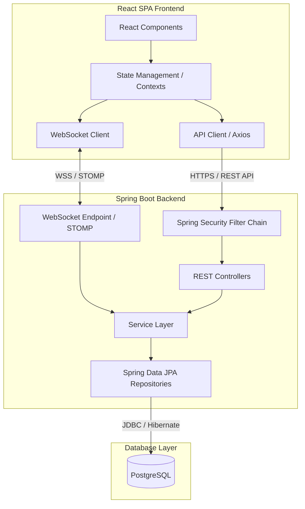
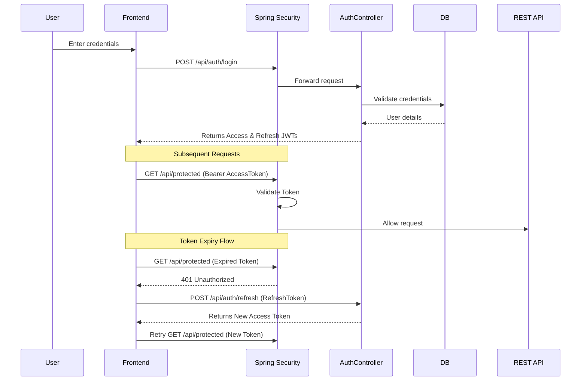
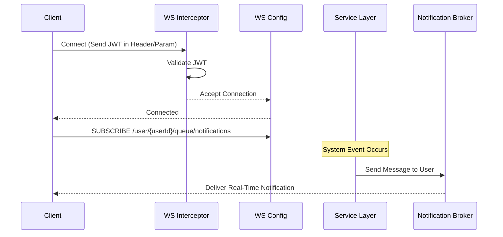
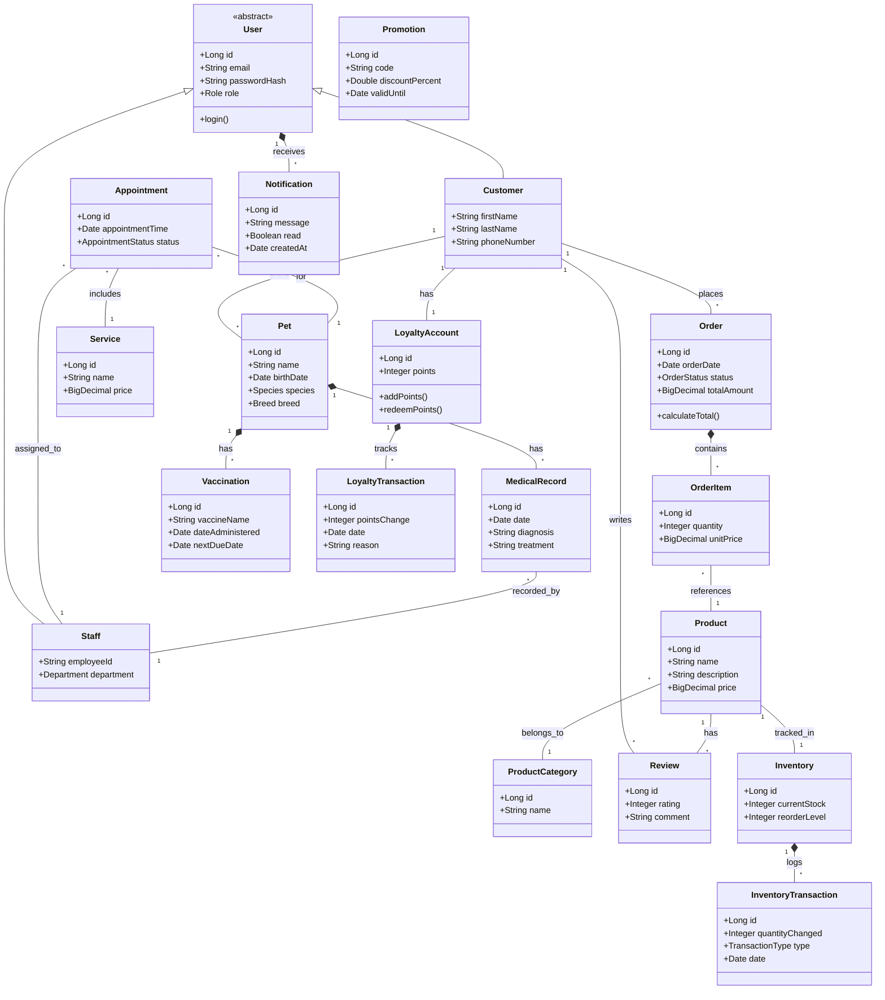
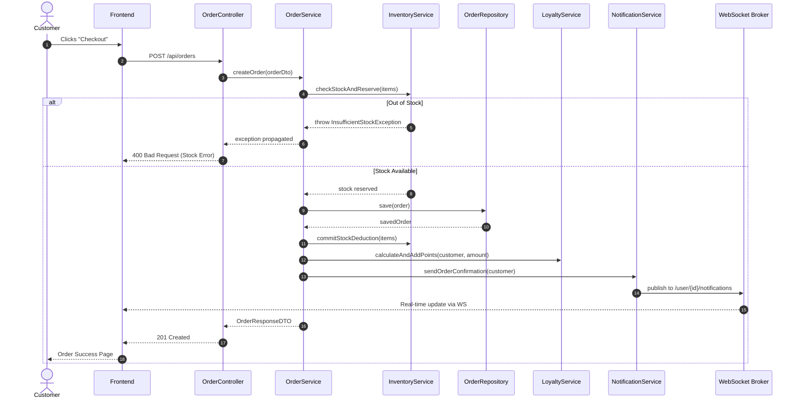

# PetCare Hub - System Architecture

## 1. System Architecture Overview
The PetCare Hub project follows a clean layered architecture pattern:
`Controller → Service → Repository → Database`

### Technology Stack
- **Backend:** Java 17+, Spring Boot 3.x, Spring MVC, Spring Data JPA, Spring Security, WebSocket, Bean Validation
- **Frontend:** React 18+, TypeScript, Tailwind CSS
- **Database:** PostgreSQL 15+
- **Testing:** JUnit 5, Mockito, Playwright
- **Build:** Maven (backend), Vite (frontend)
- **Version Control:** Git

## 2. High-Level Architecture Diagram


## 3. Backend Package Structure
```text
com.petcarehub
├── config/           (Security, WebSocket, CORS, etc.)
├── controller/       (REST controllers)
├── dto/              (Request/Response DTOs)
├── entity/           (JPA entities)
├── enums/            (State enums, role enums)
├── exception/        (Custom exceptions, global handler)
├── factory/          (Factory pattern implementations)
├── mapper/           (Entity ↔ DTO mappers)
├── observer/         (Observer pattern: events, listeners)
├── repository/       (Spring Data JPA repositories)
├── security/         (JWT, filters, user details)
├── service/          (Business logic)
│   ├── impl/
│   └── strategy/     (Strategy pattern: matching algorithms)
├── state/            (State pattern: health states, order states)
├── util/             (Utilities)
└── websocket/        (WebSocket handlers, config)
```

## 4. Frontend Structure
```text
src/
├── api/              (API client, axios config)
├── components/       (Reusable UI components)
│   ├── common/
│   ├── layout/
│   └── ui/
├── contexts/         (React contexts: Auth, Cart, Notification)
├── hooks/            (Custom hooks)
├── pages/            (Page components by role)
│   ├── customer/
│   ├── admin/
│   ├── sales/
│   ├── warehouse/
│   └── vet/
├── routes/           (Route definitions, guards)
├── services/         (WebSocket service, etc.)
├── store/            (State management)
├── types/            (TypeScript interfaces)
└── utils/            (Helpers)
```

## 5. Security Architecture
The system employs a robust security model to protect user data and ensure proper access control.

- **JWT-based stateless authentication:** No server-side session state is maintained.
- **Role-based access control (RBAC):** Administered via Spring Security to enforce permissions per user role.
- **Password Hashing:** Utilizes BCrypt for secure password storage.
- **CORS Configuration:** Configured to allow cross-origin requests specifically from the configured frontend domain.
- **CSRF Protection:** Adjusted for the Single Page Application (SPA) architecture, typically relying on stateless tokens.
- **Method-Level Security:** Business layer methods are secured using `@PreAuthorize` annotations.
- **Token Refresh Strategy:** Supports short-lived access tokens and longer-lived refresh tokens.

### Authentication Flow


## 6. WebSocket Architecture
Real-time communication is handled through WebSockets to provide instantaneous feedback and notifications.

- **Protocol:** STOMP over WebSocket with SockJS fallback for wider browser support.
- **User-Specific Channels:** Addressed to `/user/{userId}/notifications` for private alerts.
- **Topic Channels:** Used for role-based broadcasts, e.g., `/topic/warehouse/low-stock`, `/topic/sales/new-orders`.
- **Authentication:** JWTs are intercepted and validated during the initial WebSocket handshake.

### WebSocket Notification Flow


## 7. Class Diagram (Core Domain Model)


## 8. Component Interaction Diagram
**Scenario: Customer places order**



## 9. Cross-Cutting Concerns
- **Exception Handling:** Centralized through a `GlobalExceptionHandler` utilizing `@ControllerAdvice` to map exceptions to standardized API error responses.
- **Logging Strategy:** Unified logging setup utilizing SLF4J and Logback to trace requests and record application events.
- **Validation:** Utilizes Java Bean Validation (`@Valid`, `@NotNull`, etc.) alongside custom validators to enforce business rules at the entry point.
- **Pagination & Sorting:** Built using Spring Data's `Pageable` interface to ensure efficient data retrieval and consistent API responses.
- **Audit Fields:** Automatic timestamping (`createdAt`, `updatedAt`) and tracking (`createdBy`) managed via JPA Auditing (`@CreatedDate`, `@LastModifiedDate`).
- **API Versioning:** Controlled via URI path routing (e.g., `/api/v1/...`) to maintain backward compatibility.

## 10. Deployment Consideration
- **Development Environment:** Embedded Tomcat, H2 in-memory database for testing, and PostgreSQL for active development.
- **Containerization:** Comprehensive Docker support with `Dockerfile`s defined for both the Java backend and the React frontend.
- **Configuration Management:** Environment-specific settings isolated in `application-dev.yml` and `application-prod.yml` to support different deployment profiles.
