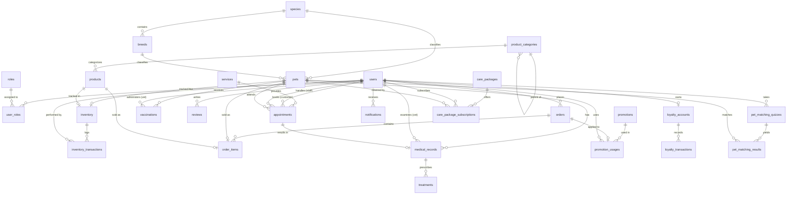

# PetCare Hub Database Schema Documentation

## 1. Database Overview

The PetCare Hub platform utilizes a robust, relational **PostgreSQL** database. The database is strictly designed following normalization principles up to the Third Normal Form (3NF) to minimize redundancy and ensure data integrity.

*   **Primary Keys**: All tables use `BIGSERIAL` (BIGINT auto-increment) as the primary key.
*   **Audit Trail**: Standard audit columns (`created_at` and `updated_at`) are present on all core tables to track data modifications.

---

## 2. ER Diagram

---

## 3. Table Details

### User & Auth

#### `users`
*   **id**: `BIGSERIAL` (PK)
*   **username**: `VARCHAR(50)` (UNIQUE, NOT NULL)
*   **email**: `VARCHAR(255)` (UNIQUE, NOT NULL)
*   **password_hash**: `VARCHAR(255)` (NOT NULL)
*   **first_name**: `VARCHAR(100)` (NOT NULL)
*   **last_name**: `VARCHAR(100)` (NOT NULL)
*   **phone**: `VARCHAR(20)`
*   **avatar_url**: `VARCHAR(255)`
*   **enabled**: `BOOLEAN` (NOT NULL, DEFAULT true)
*   **created_at**: `TIMESTAMP` (NOT NULL, DEFAULT CURRENT_TIMESTAMP)
*   **updated_at**: `TIMESTAMP` (NOT NULL, DEFAULT CURRENT_TIMESTAMP)

#### `roles`
*   **id**: `BIGSERIAL` (PK)
*   **name**: `VARCHAR(50)` (UNIQUE, NOT NULL) - Enum values: CUSTOMER, SALES_STAFF, WAREHOUSE_STAFF, VETERINARIAN, ADMIN
*   **description**: `TEXT`

#### `user_roles`
*   **user_id**: `BIGINT` (PK, FK to `users`, ON DELETE CASCADE)
*   **role_id**: `BIGINT` (PK, FK to `roles`, ON DELETE CASCADE)

### Pet Domain

#### `species`
*   **id**: `BIGSERIAL` (PK)
*   **name**: `VARCHAR(100)` (UNIQUE, NOT NULL) - e.g., Dog, Cat, Bird, Fish, Reptile, Small Animal
*   **description**: `TEXT`

#### `breeds`
*   **id**: `BIGSERIAL` (PK)
*   **species_id**: `BIGINT` (FK to `species`, NOT NULL)
*   **name**: `VARCHAR(100)` (NOT NULL)
*   **description**: `TEXT`
*   **avg_lifespan**: `VARCHAR(50)`
*   **size_category**: `VARCHAR(50)`
*   **energy_level**: `VARCHAR(50)`
*   **grooming_needs**: `VARCHAR(50)`
*   **good_with_children**: `BOOLEAN`
*   **noise_level**: `VARCHAR(50)`

#### `pets`
*   **id**: `BIGSERIAL` (PK)
*   **name**: `VARCHAR(100)`
*   **species_id**: `BIGINT` (FK to `species`, NOT NULL)
*   **breed_id**: `BIGINT` (FK to `breeds`)
*   **date_of_birth**: `DATE`
*   **gender**: `VARCHAR(20)`
*   **color**: `VARCHAR(100)`
*   **weight**: `NUMERIC(5,2)`
*   **price**: `NUMERIC(10,2)` (NOT NULL)
*   **description**: `TEXT`
*   **image_url**: `VARCHAR(255)`
*   **health_status**: `VARCHAR(50)` (NOT NULL, DEFAULT 'HEALTHY') - Constraints: HEALTHY, DUE_FOR_VACCINATION, UNDER_TREATMENT, RECOVERING, HEALTH_WARNING
*   **availability_status**: `VARCHAR(50)` (NOT NULL, DEFAULT 'AVAILABLE') - Constraints: AVAILABLE, SOLD, RESERVED, UNAVAILABLE
*   **created_at**: `TIMESTAMP` (NOT NULL, DEFAULT CURRENT_TIMESTAMP)
*   **updated_at**: `TIMESTAMP` (NOT NULL, DEFAULT CURRENT_TIMESTAMP)

### Product Domain

#### `product_categories`
*   **id**: `BIGSERIAL` (PK)
*   **name**: `VARCHAR(100)` (NOT NULL)
*   **description**: `TEXT`
*   **parent_category_id**: `BIGINT` (FK to `product_categories`, NULL)

#### `products`
*   **id**: `BIGSERIAL` (PK)
*   **name**: `VARCHAR(255)` (NOT NULL)
*   **description**: `TEXT`
*   **price**: `NUMERIC(10,2)` (NOT NULL)
*   **image_url**: `VARCHAR(255)`
*   **category_id**: `BIGINT` (FK to `product_categories`, NOT NULL)
*   **sku**: `VARCHAR(100)` (UNIQUE, NOT NULL)
*   **weight**: `NUMERIC(10,2)`
*   **dimensions**: `VARCHAR(100)`
*   **active**: `BOOLEAN` (NOT NULL, DEFAULT true)
*   **created_at**: `TIMESTAMP` (NOT NULL, DEFAULT CURRENT_TIMESTAMP)
*   **updated_at**: `TIMESTAMP` (NOT NULL, DEFAULT CURRENT_TIMESTAMP)

### Inventory

#### `inventory`
*   **id**: `BIGSERIAL` (PK)
*   **pet_id**: `BIGINT` (FK to `pets`, UNIQUE) - Either pet_id or product_id must be populated
*   **product_id**: `BIGINT` (FK to `products`, UNIQUE)
*   **quantity**: `INTEGER` (NOT NULL, DEFAULT 0)
*   **reorder_point**: `INTEGER`
*   **reorder_quantity**: `INTEGER`
*   **location**: `VARCHAR(100)`
*   **updated_at**: `TIMESTAMP` (NOT NULL, DEFAULT CURRENT_TIMESTAMP)
*   Check Constraint: `(pet_id IS NOT NULL AND product_id IS NULL) OR (pet_id IS NULL AND product_id IS NOT NULL)`

#### `inventory_transactions`
*   **id**: `BIGSERIAL` (PK)
*   **inventory_id**: `BIGINT` (FK to `inventory`, NOT NULL)
*   **transaction_type**: `VARCHAR(50)` (NOT NULL) - STOCK_IN, STOCK_OUT, ADJUSTMENT, RETURN
*   **quantity**: `INTEGER` (NOT NULL)
*   **reference_type**: `VARCHAR(50)`
*   **reference_id**: `BIGINT`
*   **notes**: `TEXT`
*   **performed_by**: `BIGINT` (FK to `users`, NOT NULL)
*   **created_at**: `TIMESTAMP` (NOT NULL, DEFAULT CURRENT_TIMESTAMP)

### Order Domain

#### `orders`
*   **id**: `BIGSERIAL` (PK)
*   **customer_id**: `BIGINT` (FK to `users`, NOT NULL)
*   **order_number**: `VARCHAR(100)` (UNIQUE, NOT NULL)
*   **status**: `VARCHAR(50)` (NOT NULL) - PENDING, CONFIRMED, PROCESSING, SHIPPING, DELIVERED, CANCELLED
*   **subtotal**: `NUMERIC(10,2)` (NOT NULL)
*   **discount_amount**: `NUMERIC(10,2)` (NOT NULL, DEFAULT 0)
*   **tax_amount**: `NUMERIC(10,2)` (NOT NULL, DEFAULT 0)
*   **total_amount**: `NUMERIC(10,2)` (NOT NULL)
*   **shipping_address**: `TEXT`
*   **payment_method**: `VARCHAR(50)`
*   **payment_status**: `VARCHAR(50)`
*   **notes**: `TEXT`
*   **created_at**: `TIMESTAMP` (NOT NULL, DEFAULT CURRENT_TIMESTAMP)
*   **updated_at**: `TIMESTAMP` (NOT NULL, DEFAULT CURRENT_TIMESTAMP)

#### `order_items`
*   **id**: `BIGSERIAL` (PK)
*   **order_id**: `BIGINT` (FK to `orders`, NOT NULL, ON DELETE CASCADE)
*   **item_type**: `VARCHAR(50)` (NOT NULL) - PET, PRODUCT
*   **pet_id**: `BIGINT` (FK to `pets`)
*   **product_id**: `BIGINT` (FK to `products`)
*   **quantity**: `INTEGER` (NOT NULL)
*   **unit_price**: `NUMERIC(10,2)` (NOT NULL)
*   **subtotal**: `NUMERIC(10,2)` (NOT NULL)

### Service Domain

#### `services`
*   **id**: `BIGSERIAL` (PK)
*   **name**: `VARCHAR(100)` (NOT NULL)
*   **description**: `TEXT`
*   **service_type**: `VARCHAR(50)` (NOT NULL) - GROOMING, VETERINARY
*   **duration_minutes**: `INTEGER` (NOT NULL)
*   **price**: `NUMERIC(10,2)` (NOT NULL)
*   **active**: `BOOLEAN` (NOT NULL, DEFAULT true)
*   **created_at**: `TIMESTAMP` (NOT NULL, DEFAULT CURRENT_TIMESTAMP)

#### `appointments`
*   **id**: `BIGSERIAL` (PK)
*   **customer_id**: `BIGINT` (FK to `users`, NOT NULL)
*   **pet_id**: `BIGINT` (FK to `pets`, NOT NULL)
*   **service_id**: `BIGINT` (FK to `services`, NOT NULL)
*   **staff_id**: `BIGINT` (FK to `users`, NOT NULL)
*   **appointment_date**: `DATE` (NOT NULL)
*   **start_time**: `TIME` (NOT NULL)
*   **end_time**: `TIME` (NOT NULL)
*   **status**: `VARCHAR(50)` (NOT NULL) - SCHEDULED, CONFIRMED, IN_PROGRESS, COMPLETED, CANCELLED, NO_SHOW
*   **notes**: `TEXT`
*   **created_at**: `TIMESTAMP` (NOT NULL, DEFAULT CURRENT_TIMESTAMP)
*   **updated_at**: `TIMESTAMP` (NOT NULL, DEFAULT CURRENT_TIMESTAMP)

### Medical Domain

#### `medical_records`
*   **id**: `BIGSERIAL` (PK)
*   **pet_id**: `BIGINT` (FK to `pets`, NOT NULL)
*   **veterinarian_id**: `BIGINT` (FK to `users`, NOT NULL)
*   **appointment_id**: `BIGINT` (FK to `appointments`)
*   **examination_date**: `DATE` (NOT NULL)
*   **findings**: `TEXT` (NOT NULL)
*   **diagnosis**: `TEXT`
*   **recommendations**: `TEXT`
*   **created_at**: `TIMESTAMP` (NOT NULL, DEFAULT CURRENT_TIMESTAMP)

#### `vaccinations`
*   **id**: `BIGSERIAL` (PK)
*   **pet_id**: `BIGINT` (FK to `pets`, NOT NULL)
*   **veterinarian_id**: `BIGINT` (FK to `users`, NOT NULL)
*   **vaccine_name**: `VARCHAR(100)` (NOT NULL)
*   **vaccine_batch_number**: `VARCHAR(100)`
*   **date_administered**: `DATE` (NOT NULL)
*   **next_due_date**: `DATE`
*   **notes**: `TEXT`
*   **created_at**: `TIMESTAMP` (NOT NULL, DEFAULT CURRENT_TIMESTAMP)

#### `treatments`
*   **id**: `BIGSERIAL` (PK)
*   **medical_record_id**: `BIGINT` (FK to `medical_records`, NOT NULL)
*   **medication**: `VARCHAR(100)` (NOT NULL)
*   **dosage**: `VARCHAR(100)` (NOT NULL)
*   **frequency**: `VARCHAR(100)` (NOT NULL)
*   **start_date**: `DATE` (NOT NULL)
*   **end_date**: `DATE`
*   **follow_up_date**: `DATE`
*   **status**: `VARCHAR(50)` (NOT NULL) - ACTIVE, COMPLETED, DISCONTINUED
*   **notes**: `TEXT`

### Customer Engagement

#### `reviews`
*   **id**: `BIGSERIAL` (PK)
*   **customer_id**: `BIGINT` (FK to `users`, NOT NULL)
*   **reviewable_type**: `VARCHAR(50)` (NOT NULL) - PET, PRODUCT, SERVICE
*   **reviewable_id**: `BIGINT` (NOT NULL)
*   **rating**: `INTEGER` (NOT NULL) - Check: 1 to 5
*   **comment**: `TEXT`
*   **approved**: `BOOLEAN` (NOT NULL, DEFAULT false)
*   **created_at**: `TIMESTAMP` (NOT NULL, DEFAULT CURRENT_TIMESTAMP)
*   **updated_at**: `TIMESTAMP` (NOT NULL, DEFAULT CURRENT_TIMESTAMP)

#### `promotions`
*   **id**: `BIGSERIAL` (PK)
*   **code**: `VARCHAR(50)` (UNIQUE, NOT NULL)
*   **description**: `TEXT`
*   **discount_type**: `VARCHAR(50)` (NOT NULL) - PERCENTAGE, FIXED_AMOUNT
*   **discount_value**: `NUMERIC(10,2)` (NOT NULL)
*   **min_order_amount**: `NUMERIC(10,2)`
*   **max_uses**: `INTEGER`
*   **current_uses**: `INTEGER` (NOT NULL, DEFAULT 0)
*   **start_date**: `TIMESTAMP`
*   **end_date**: `TIMESTAMP`
*   **active**: `BOOLEAN` (NOT NULL, DEFAULT true)
*   **created_at**: `TIMESTAMP` (NOT NULL, DEFAULT CURRENT_TIMESTAMP)

#### `promotion_usages`
*   **id**: `BIGSERIAL` (PK)
*   **promotion_id**: `BIGINT` (FK to `promotions`, NOT NULL)
*   **order_id**: `BIGINT` (FK to `orders`, NOT NULL)
*   **customer_id**: `BIGINT` (FK to `users`, NOT NULL)
*   **created_at**: `TIMESTAMP` (NOT NULL, DEFAULT CURRENT_TIMESTAMP)

### Loyalty

#### `loyalty_accounts`
*   **id**: `BIGSERIAL` (PK)
*   **customer_id**: `BIGINT` (FK to `users`, UNIQUE, NOT NULL)
*   **total_points**: `INTEGER` (NOT NULL, DEFAULT 0)
*   **available_points**: `INTEGER` (NOT NULL, DEFAULT 0)
*   **membership_level**: `VARCHAR(50)` (NOT NULL, DEFAULT 'BRONZE') - BRONZE, SILVER, GOLD, PLATINUM
*   **created_at**: `TIMESTAMP` (NOT NULL, DEFAULT CURRENT_TIMESTAMP)
*   **updated_at**: `TIMESTAMP` (NOT NULL, DEFAULT CURRENT_TIMESTAMP)

#### `loyalty_transactions`
*   **id**: `BIGSERIAL` (PK)
*   **loyalty_account_id**: `BIGINT` (FK to `loyalty_accounts`, NOT NULL)
*   **transaction_type**: `VARCHAR(50)` (NOT NULL) - EARN, REDEEM, EXPIRE, ADJUST
*   **points**: `INTEGER` (NOT NULL)
*   **source_type**: `VARCHAR(50)` (NOT NULL) - PURCHASE, SERVICE_BOOKING, REVIEW, CARE_PACKAGE, REDEMPTION
*   **source_id**: `BIGINT`
*   **description**: `TEXT`
*   **created_at**: `TIMESTAMP` (NOT NULL, DEFAULT CURRENT_TIMESTAMP)

### Notifications

#### `notifications`
*   **id**: `BIGSERIAL` (PK)
*   **user_id**: `BIGINT` (FK to `users`, NOT NULL)
*   **type**: `VARCHAR(50)` (NOT NULL) - ORDER_UPDATE, APPOINTMENT_REMINDER, VACCINATION_DUE, LOW_STOCK, GROOMING_COMPLETE, SYSTEM
*   **title**: `VARCHAR(255)` (NOT NULL)
*   **message**: `TEXT` (NOT NULL)
*   **read**: `BOOLEAN` (NOT NULL, DEFAULT false)
*   **data_json**: `JSONB`
*   **created_at**: `TIMESTAMP` (NOT NULL, DEFAULT CURRENT_TIMESTAMP)

### Pet Matching

#### `pet_matching_quizzes`
*   **id**: `BIGSERIAL` (PK)
*   **customer_id**: `BIGINT` (FK to `users`, NOT NULL)
*   **living_environment**: `VARCHAR(100)`
*   **house_size**: `VARCHAR(100)`
*   **has_children**: `BOOLEAN`
*   **children_age_range**: `VARCHAR(100)`
*   **activity_level**: `VARCHAR(100)`
*   **daily_care_hours**: `NUMERIC(4,2)`
*   **pet_experience**: `VARCHAR(100)`
*   **size_preference**: `VARCHAR(100)`
*   **energy_preference**: `VARCHAR(100)`
*   **grooming_tolerance**: `VARCHAR(100)`
*   **noise_tolerance**: `VARCHAR(100)`
*   **created_at**: `TIMESTAMP` (NOT NULL, DEFAULT CURRENT_TIMESTAMP)

#### `pet_matching_results`
*   **id**: `BIGSERIAL` (PK)
*   **quiz_id**: `BIGINT` (FK to `pet_matching_quizzes`, NOT NULL, ON DELETE CASCADE)
*   **pet_id**: `BIGINT` (FK to `pets`, NOT NULL)
*   **overall_score**: `INTEGER` (NOT NULL)
*   **score_breakdown_json**: `JSONB`
*   **explanation**: `TEXT`
*   **rank**: `INTEGER` (NOT NULL)

### Care Packages

#### `care_packages`
*   **id**: `BIGSERIAL` (PK)
*   **name**: `VARCHAR(255)` (NOT NULL)
*   **description**: `TEXT`
*   **price**: `NUMERIC(10,2)` (NOT NULL)
*   **duration_months**: `INTEGER` (NOT NULL)
*   **includes_grooming**: `BOOLEAN` (NOT NULL, DEFAULT false)
*   **includes_checkup**: `BOOLEAN` (NOT NULL, DEFAULT false)
*   **includes_vaccination**: `BOOLEAN` (NOT NULL, DEFAULT false)
*   **active**: `BOOLEAN` (NOT NULL, DEFAULT true)
*   **created_at**: `TIMESTAMP` (NOT NULL, DEFAULT CURRENT_TIMESTAMP)

#### `care_package_subscriptions`
*   **id**: `BIGSERIAL` (PK)
*   **customer_id**: `BIGINT` (FK to `users`, NOT NULL)
*   **pet_id**: `BIGINT` (FK to `pets`, NOT NULL)
*   **package_id**: `BIGINT` (FK to `care_packages`, NOT NULL)
*   **start_date**: `DATE` (NOT NULL)
*   **end_date**: `DATE` (NOT NULL)
*   **status**: `VARCHAR(50)` (NOT NULL) - ACTIVE, EXPIRED, CANCELLED
*   **auto_renew**: `BOOLEAN` (NOT NULL, DEFAULT true)
*   **created_at**: `TIMESTAMP` (NOT NULL, DEFAULT CURRENT_TIMESTAMP)

---

## 4. Key Relationships Summary

| Entity/Table | Foreign Keys To | Relationship Type |
| :--- | :--- | :--- |
| `user_roles` | `users`, `roles` | Many-to-Many resolution table |
| `breeds` | `species` | Many-to-One |
| `pets` | `species`, `breeds` | Many-to-One |
| `product_categories` | `product_categories` | Hierarchical (Self-referencing) |
| `products` | `product_categories` | Many-to-One |
| `inventory` | `pets` or `products` | One-to-One (polymorphic tracking) |
| `inventory_transactions` | `inventory`, `users` | Many-to-One |
| `orders` | `users` | Many-to-One |
| `order_items` | `orders`, (`pets` or `products`) | Many-to-One |
| `appointments` | `users` (x2), `pets`, `services` | Many-to-One |
| `medical_records` | `pets`, `users`, `appointments` | Many-to-One |
| `vaccinations` | `pets`, `users` | Many-to-One |
| `treatments` | `medical_records` | Many-to-One |
| `reviews` | `users` | Many-to-One (Polymorphic target) |
| `promotion_usages` | `promotions`, `orders`, `users` | Many-to-One |
| `loyalty_accounts` | `users` | One-to-One |
| `loyalty_transactions` | `loyalty_accounts` | Many-to-One |
| `notifications` | `users` | Many-to-One |
| `pet_matching_quizzes` | `users` | Many-to-One |
| `pet_matching_results` | `pet_matching_quizzes`, `pets` | Many-to-One |
| `care_package_subscriptions` | `users`, `pets`, `care_packages` | Many-to-One |

---

## 5. Indexing Strategy

*   **Primary Keys**: Auto-indexed via standard primary key constraint.
*   **Foreign Keys**: Standard B-Tree indices applied to all Foreign Key columns to accelerate joins.
*   **Frequently Queried Columns**:
    *   `users(email)`
    *   `users(username)`
    *   `orders(order_number)`
    *   `orders(status)`
    *   `products(sku)`
    *   `appointments(status)`
    *   `appointments(appointment_date)`
    *   `pets(availability_status)`
*   **Composite Indexes**:
    *   `appointments(staff_id, appointment_date)` - For staff scheduling queries.
    *   `order_items(order_id, item_type)`

---

## 6. Data Integrity Rules

*   **Referential Integrity**: Maintained by Foreign Key constraints throughout the schema.
*   **Check Constraints**: Enforced at the application/ORM level and optionally via PostgreSQL CHECK constraints on string columns containing predefined enum values.
*   **Unique Constraints**: Enforced on `users.email`, `users.username`, `orders.order_number`, `products.sku`, `promotions.code`, `species.name`, and `roles.name`.
*   **Cascade Rules**: `ON DELETE CASCADE` is primarily used for child relationships like `user_roles` linking records, `order_items`, and `pet_matching_results`. Standard behavior restricts deletion if related child records exist (e.g., cannot delete a user if they have placed orders).

---

## 7. Seed Data Requirements

### Default Roles
*   `ADMIN`, `CUSTOMER`, `SALES_STAFF`, `WAREHOUSE_STAFF`, `VETERINARIAN`

### Default Admin User
*   Username: `admin`
*   Email: `admin@petcarehub.com`
*   Role: `ADMIN`

### Sample Species & Breeds
*   **Species**: Dog, Cat, Bird, Small Animal
*   **Breeds**:
    *   Dog: Golden Retriever, French Bulldog, German Shepherd
    *   Cat: Persian, Maine Coon, Siamese
    *   Bird: Parakeet, Cockatiel

### Sample Product Categories
*   Food & Treats (Parent)
    *   Dry Food (Child)
    *   Wet Food (Child)
*   Toys
*   Health & Wellness
*   Accessories

### Sample Services
*   **Grooming**: Basic Bath & Brush, Full Groom, Nail Trimming
*   **Veterinary**: Wellness Exam, Vaccination Visit, Dental Checkup
