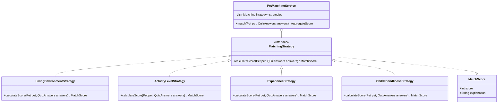
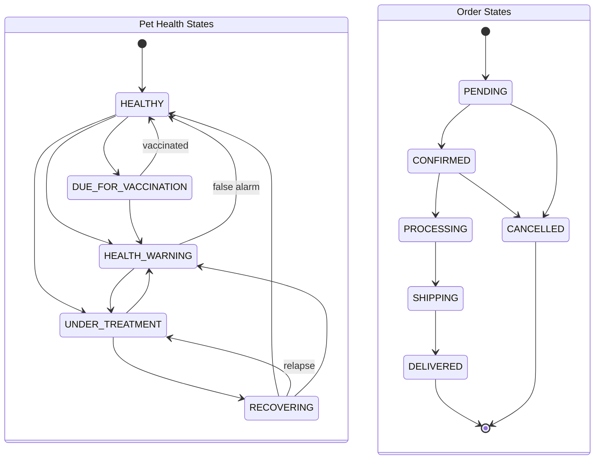
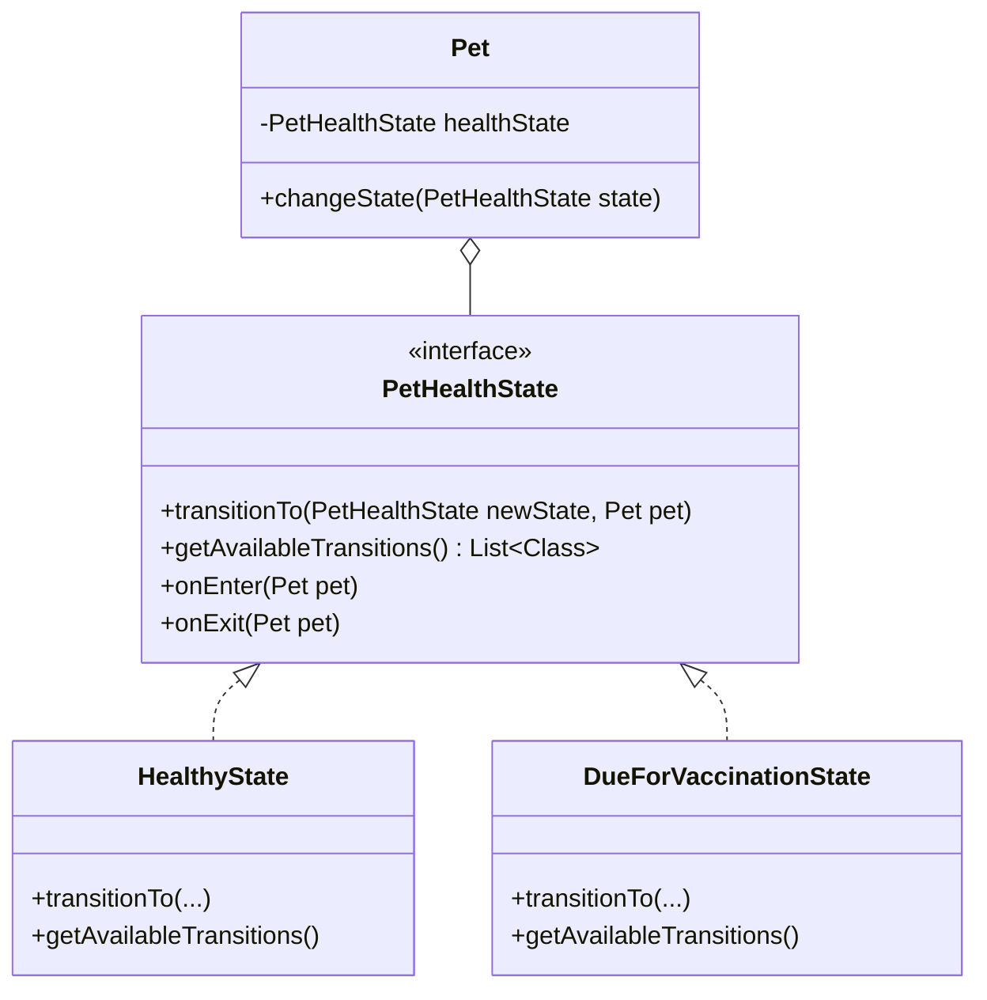
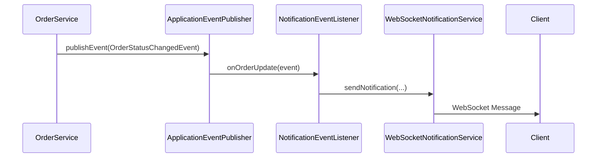
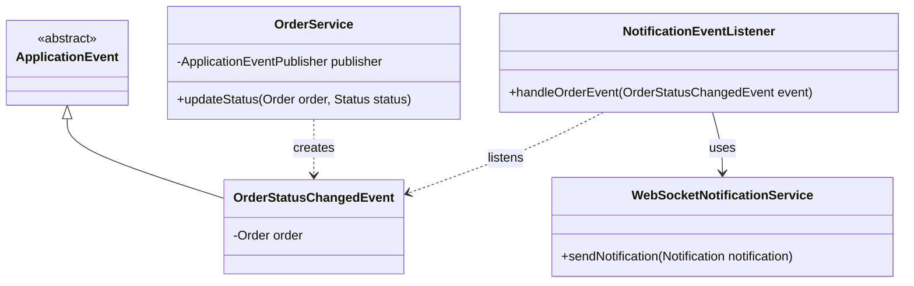
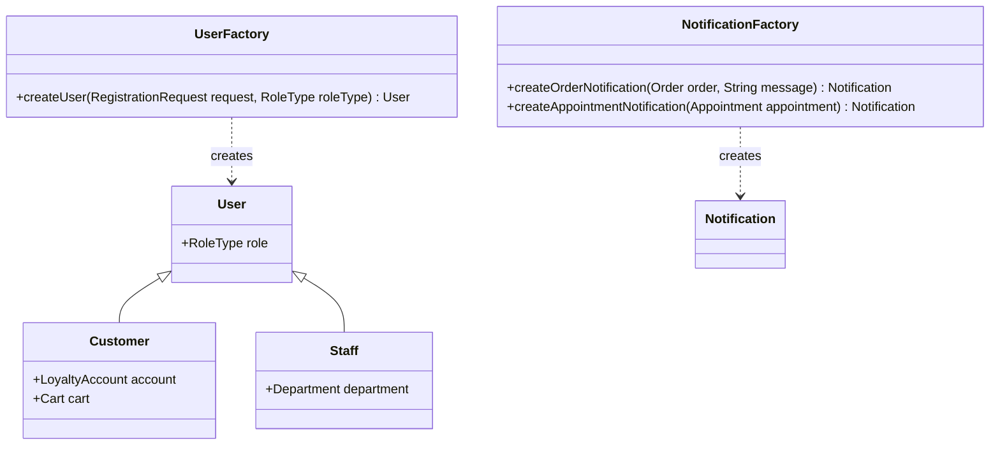
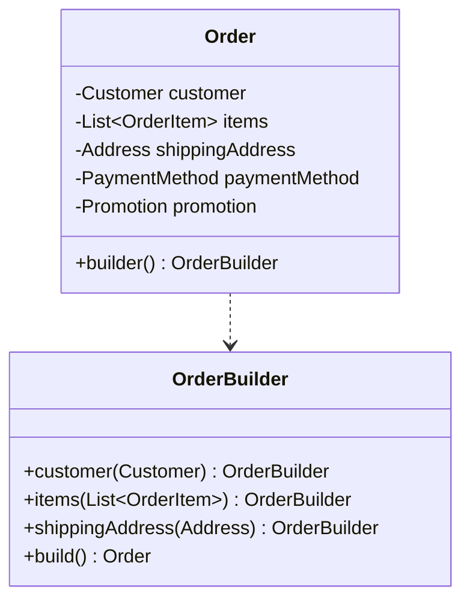
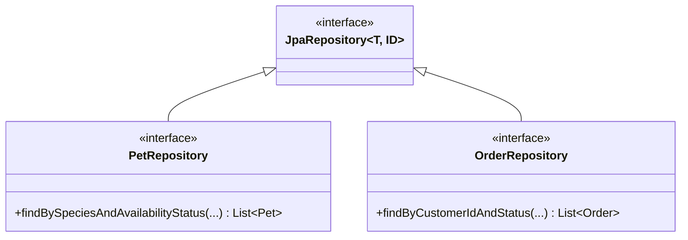

# PetCare Hub - Design Patterns Documentation

This document outlines the software design patterns applied in the PetCare Hub project, mapping each pattern to concrete features with detailed explanations, class diagrams, and code structures.

## 1. Strategy Pattern — Pet Matching Algorithm

### Problem
Different matching criteria (living environment, activity level, experience, etc.) require different scoring algorithms. The system must be extensible so that new matching dimensions can be added without modifying existing code.

### Solution
Define a `MatchingStrategy` interface with a `calculateScore(Pet pet, QuizAnswers answers)` method returning a `MatchScore` (score + explanation). Concrete implementations handle specific scoring dimensions. A `PetMatchingService` holds a collection of strategies and aggregates their scores.

#### Class Diagram


#### Code Structure
```java
// MatchScore.java
public class MatchScore {
    private int score;
    private String explanation;
    // Getters, Setters, Constructors
}

// MatchingStrategy.java
public interface MatchingStrategy {
    MatchScore calculateScore(Pet pet, QuizAnswers answers);
}

// LivingEnvironmentStrategy.java
@Component
public class LivingEnvironmentStrategy implements MatchingStrategy {
    @Override
    public MatchScore calculateScore(Pet pet, QuizAnswers answers) {
        int score = 0;
        String explanation = "Pet size fits well with living space.";
        // Implementation logic...
        return new MatchScore(score, explanation);
    }
}

// PetMatchingService.java
@Service
public class PetMatchingService {
    private final List<MatchingStrategy> strategies;

    @Autowired
    public PetMatchingService(List<MatchingStrategy> strategies) {
        this.strategies = strategies;
    }

    public AggregateScore match(Pet pet, QuizAnswers answers) {
        int totalScore = 0;
        List<String> explanations = new ArrayList<>();
        
        for (MatchingStrategy strategy : strategies) {
            MatchScore score = strategy.calculateScore(pet, answers);
            totalScore += score.getScore();
            explanations.add(score.getExplanation());
        }
        
        return new AggregateScore(totalScore, explanations);
    }
}
```

## 2. State Pattern — Pet Health State & Order State

### Problem
Pet health status and order status have strict state transition rules. Invalid transitions must be prevented, and different states trigger different behaviors (like notifications or validations).

### Solution

#### Pet Health State Machine
Define a `PetHealthState` interface to manage health transitions.

#### Order State Machine
Similar structure with `OrderState` interface for lifecycle transitions.

#### State Transition Tables
**Pet Health States:**
| Current State | Allowed Transitions |
|---|---|
| HEALTHY | DUE_FOR_VACCINATION, UNDER_TREATMENT, HEALTH_WARNING |
| DUE_FOR_VACCINATION | HEALTHY (vaccinated), HEALTH_WARNING |
| UNDER_TREATMENT | RECOVERING, HEALTH_WARNING |
| RECOVERING | HEALTHY, UNDER_TREATMENT (relapse), HEALTH_WARNING |
| HEALTH_WARNING | UNDER_TREATMENT, HEALTHY (false alarm) |

**Order States:**
| Current State | Allowed Transitions |
|---|---|
| PENDING | CONFIRMED, CANCELLED |
| CONFIRMED | PROCESSING, CANCELLED |
| PROCESSING | SHIPPING |
| SHIPPING | DELIVERED |
| DELIVERED | (none — terminal) |
| CANCELLED | (none — terminal) |

#### State Diagrams


#### Class Diagram


#### Code Structure
```java
// PetHealthState.java
public interface PetHealthState {
    void transitionTo(PetHealthState newState, Pet pet);
    List<Class<? extends PetHealthState>> getAvailableTransitions();
    void onEnter(Pet pet);
    void onExit(Pet pet);
}

// HealthyState.java
public class HealthyState implements PetHealthState {
    @Override
    public void transitionTo(PetHealthState newState, Pet pet) {
        if (getAvailableTransitions().contains(newState.getClass())) {
            this.onExit(pet);
            pet.setHealthState(newState);
            newState.onEnter(pet);
        } else {
            throw new IllegalStateException("Invalid state transition");
        }
    }

    @Override
    public List<Class<? extends PetHealthState>> getAvailableTransitions() {
        return Arrays.asList(DueForVaccinationState.class, UnderTreatmentState.class, HealthWarningState.class);
    }
    
    @Override
    public void onEnter(Pet pet) { /* setup healthy flags */ }
    
    @Override
    public void onExit(Pet pet) { /* cleanup */ }
}
```

## 3. Observer Pattern — Real-Time Notifications

### Problem
Multiple events across the system (order updates, appointment changes, health alerts) must trigger notifications to users via WebSocket asynchronously.

### Solution
Use Spring's application event publishing framework to decouple event sources from notification logic.

#### Sequence & Class Diagrams




#### Code Structure
```java
// OrderStatusChangedEvent.java
public class OrderStatusChangedEvent extends ApplicationEvent {
    private final Order order;
    
    public OrderStatusChangedEvent(Object source, Order order) {
        super(source);
        this.order = order;
    }
    public Order getOrder() { return order; }
}

// OrderService.java
@Service
public class OrderService {
    @Autowired
    private ApplicationEventPublisher publisher;
    
    public void updateStatus(Order order, OrderStatus newStatus) {
        order.setStatus(newStatus);
        // Save order logic...
        publisher.publishEvent(new OrderStatusChangedEvent(this, order));
    }
}

// NotificationEventListener.java
@Component
public class NotificationEventListener {
    @Autowired
    private WebSocketNotificationService webSocketService;

    @EventListener
    public void handleOrderStatusChange(OrderStatusChangedEvent event) {
        Notification notification = new Notification("Order Update", "Status changed to " + event.getOrder().getStatus());
        webSocketService.sendNotification(event.getOrder().getCustomerId(), notification);
    }
}
```

## 4. Factory Pattern — User & Notification Creation

### Problem
User creation requires complex initialization depending on the role (e.g., customers get loyalty accounts, staff get special defaults). Notification objects also vary significantly by type.

### Solution
Implement `UserFactory` and `NotificationFactory` to abstract object creation logic.

#### Class Diagram


#### Code Structure
```java
@Component
public class UserFactory {
    public User createUser(RegistrationRequest request, RoleType roleType) {
        switch(roleType) {
            case CUSTOMER:
                Customer customer = new Customer(request);
                customer.setLoyaltyAccount(new LoyaltyAccount(LoyaltyTier.BRONZE));
                customer.setCart(new Cart());
                return customer;
            case SALES_STAFF:
                Staff salesStaff = new Staff(request, Department.SALES);
                return salesStaff;
            default:
                throw new IllegalArgumentException("Unknown role type");
        }
    }
}
```

## 5. Builder Pattern — Complex Domain Object Creation

### Problem
Domain models like `Order`, `MedicalRecord`, and `PetMatchingQuiz` contain many optional fields, making constructors unwieldy.

### Solution
Utilize the Builder pattern (often via Lombok `@Builder`) for clear, fluent instantiation of complex objects.

#### Class Diagram


#### Code Structure
```java
@Entity
@Builder
@Getter
@NoArgsConstructor
@AllArgsConstructor
public class Order {
    @Id
    @GeneratedValue
    private Long id;
    
    @ManyToOne
    private Customer customer;
    
    @OneToMany
    private List<OrderItem> items;
    
    private Address shippingAddress;
    private PaymentMethod paymentMethod;
    private Promotion promotion;
}

// Usage Example
public void createOrder(Customer c, List<OrderItem> items, Address addr) {
    Order newOrder = Order.builder()
                        .customer(c)
                        .items(items)
                        .shippingAddress(addr)
                        .build();
}
```

## 6. Repository Pattern — Persistence Abstraction

### Problem
Business logic must remain isolated from direct database interaction mechanics and SQL dialects.

### Solution
Use Spring Data JPA repositories with custom query methods and the Specification pattern for dynamic query building.

#### Class Diagram


#### Code Structure
```java
@Repository
public interface PetRepository extends JpaRepository<Pet, Long>, JpaSpecificationExecutor<Pet> {
    List<Pet> findBySpeciesAndAvailabilityStatus(Species species, Status status);
    
    // Custom query via JPQL
    @Query("SELECT p FROM Pet p WHERE p.age < :maxAge")
    List<Pet> findYoungPets(@Param("maxAge") int maxAge);
}
```

## 7. Pattern Integration Map

| Pattern | Applied To | Problem Solved | Key Classes |
|---------|-----------|---------------|-------------|
| Strategy | Pet Matching | Extensible scoring algorithms | `MatchingStrategy`, `PetMatchingService` |
| State | Health & Order status | Valid state transitions | `PetHealthState`, `OrderState` |
| Observer | Notifications | Decoupled event handling | `ApplicationEvent`, `EventListener`, `WebSocket` |
| Factory | User & Notification creation | Consistent object initialization | `UserFactory`, `NotificationFactory` |
| Builder | Orders, MedicalRecords | Complex object construction | Lombok `@Builder` |
| Repository | Data access | Persistence abstraction | `JpaRepository` extensions |

## 8. OOP Principles Demonstrated

- **Inheritance**: `ApplicationEvent` hierarchy; State interface implementations forming distinct state classes.
- **Encapsulation**: State logic is fully encapsulated within the state classes; matching logic is hidden inside strategies.
- **Polymorphism**: The `MatchingStrategy` interface allows for interchanging matching algorithms at runtime; `PetHealthState` allows uniform transition method calls.
- **Composition**: Service classes (e.g., `PetMatchingService`) compose one or multiple strategies to function; orders are composed of items.
- **Aggregation**: A `Pet` aggregates multiple `MedicalRecord` objects, existing independently but referenced logically.
