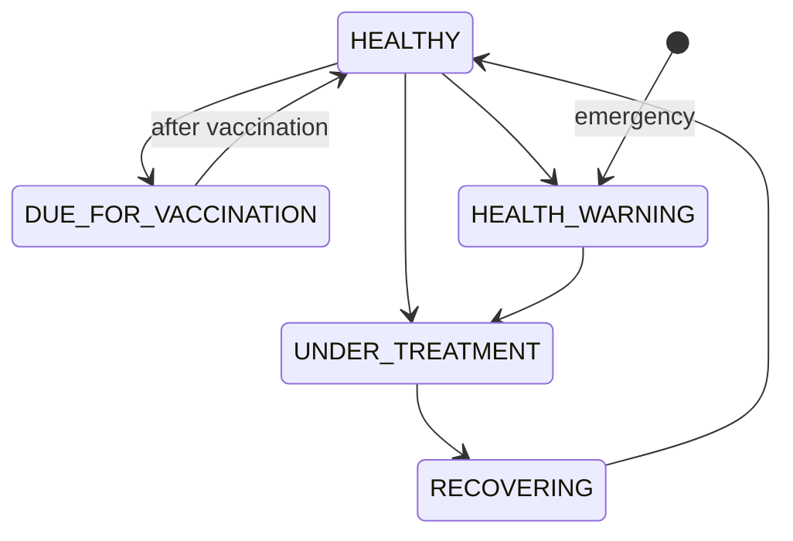
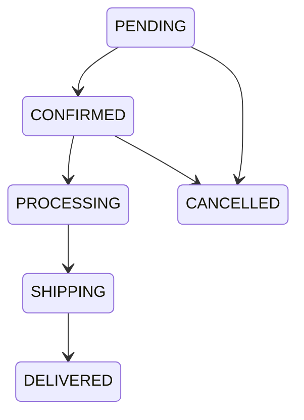

# PetCare Hub - Requirements Specification

## 1. Project Overview
PetCare Hub: a data-driven pet shop management platform combining pet sales, accessories, grooming, veterinary services, care packages, health records, vaccination tracking, loyalty programs, pet matching, real-time notifications, and role-based management.

## 2. Business Roles & Permissions Matrix

| Role | Permissions |
| :--- | :--- |
| **Customer** | Browse, purchase, book services, manage personal pets, loyalty |
| **Sales Staff** | Order management, promotions, customer consultation, reviews |
| **Warehouse Staff** | Inventory management (pet + product), stock in/out, low-stock alerts |
| **Veterinarian** | Medical records, examinations, vaccinations, treatments, follow-ups |
| **Administrator** | Full system access, user/role management, reports, dashboards, configuration |

## 3. Functional Requirements

### CUSTOMER
- Register/login
- Browse pets with search/filter (species, breed, age, price, size)
- Browse products with categories
- Pet detail page (photos, health status, breed info, compatibility hints)
- Product detail page
- Shopping cart (add, remove, update quantity, persist across sessions)
- Checkout (address, payment method selection, order summary, order confirmation)
- Order tracking with real-time status updates
- Service booking (grooming, veterinary)
- Personal pet profiles (register owned pets)
- Pet health history view
- Vaccination schedule view
- Write reviews for purchased pets/products/services
- Loyalty points accumulation and redemption
- Membership levels: Bronze → Silver → Gold → Platinum
- Real-time notifications (order updates, appointment reminders, health alerts)
- Pet matching quiz (questionnaire → scoring algorithm → ranked results with explanations)

### SALES STAFF
- View and manage orders
- Update order status (with state machine validation)
- Customer consultation notes
- Create and manage promotions (discount codes, percentage/fixed, date range, usage limits)
- Moderate customer reviews

### WAREHOUSE STAFF
- Manage pet inventory (add new pets, update status, track availability)
- Manage product inventory (stock levels, reorder points)
- Stock-in transactions (receiving new stock)
- Stock-out transactions (fulfilling orders, damages, returns)
- Low-stock alerts (configurable thresholds)
- Inventory transaction history with audit trail

### VETERINARIAN
- Create and update pet medical records
- Record examinations (findings, diagnosis, recommendations)
- Record vaccinations (vaccine type, date, next due date, batch number)
- Record treatments (medication, dosage, duration, follow-up)
- Schedule follow-up appointments
- Update pet health status (with state machine validation)

### ADMIN
- CRUD operations on users, roles, pets, products, services, staff
- Revenue reports (daily, weekly, monthly, by category)
- Revenue dashboard with charts
- Inventory dashboard (stock levels, low-stock items, transaction volume)
- System configuration (loyalty rules, notification settings, service pricing)

## 4. Non-Functional Requirements
- **Performance**: API responses < 500ms for common operations
- **Security**: JWT authentication, role-based authorization, input validation, CSRF protection
- **Scalability**: Stateless backend, connection pooling
- **Reliability**: Transaction management, data integrity constraints
- **Usability**: Responsive UI, accessible design
- **Maintainability**: Clean architecture, comprehensive testing

## 5. Pet Matching Requirements

### Questionnaire Fields
- Living environment (apartment/house/farm)
- House size (small/medium/large)
- Presence of children (yes with ages / no)
- Activity level (sedentary/moderate/active/very active)
- Available daily care time (hours)
- Previous pet experience (none/some/experienced)
- Preferred characteristics (size preference, energy level, grooming needs, noise tolerance)

### Scoring Algorithm Requirements
- Transparent scoring: each factor contributes a weighted score
- Explainability: each pet result includes per-factor scores and text explanations
- No external AI API: pure coded logic
- Configurable weights

## 6. State Machine Requirements

### Pet Health States
- `HEALTHY` → `DUE_FOR_VACCINATION` → `HEALTHY` (after vaccination)
- `HEALTHY` → `UNDER_TREATMENT` → `RECOVERING` → `HEALTHY`
- `HEALTHY` → `HEALTH_WARNING` → `UNDER_TREATMENT`
- Any state → `HEALTH_WARNING` (emergency)
- Prevent: `RECOVERING` → `DUE_FOR_VACCINATION` directly

### Order States
- `PENDING` → `CONFIRMED` → `PROCESSING` → `SHIPPING` → `DELIVERED`
- `PENDING` → `CANCELLED`
- `CONFIRMED` → `CANCELLED`
- Prevent: `SHIPPING` → `PENDING`, `DELIVERED` → any other state

## 7. Loyalty System Requirements

### Points Earning
- Purchases: 1 point per $1 spent
- Service bookings: 2 points per $1
- Reviews: 50 points per review
- Care package renewals: 100 bonus points

### Membership Thresholds (Configurable)
- Bronze: 0-499 points
- Silver: 500-1999 points
- Gold: 2000-4999 points
- Platinum: 5000+ points

### Benefits per Tier (Configurable)
- Bronze: 0% discount
- Silver: 5% discount
- Gold: 10% discount + free basic grooming
- Platinum: 15% discount + free grooming + priority booking

## 8. Real-Time Notification Requirements
WebSocket channels:
- Order status changes
- Appointment confirmations
- Appointment reminders (24h before)
- Grooming completion
- Vaccination due reminders
- Low-stock alerts (warehouse staff)
- New order alerts (sales staff)

## 9. Identified Ambiguities & Assumptions

| # | Ambiguity | Assumption |
| :--- | :--- | :--- |
| 1 | Payment integration | assumed mock/simulated payment, not real gateway |
| 2 | Pet image storage | assumed local file system, not cloud storage |
| 3 | Multi-language support | not mentioned, assumed English only |
| 4 | Care packages | mentioned but details not specified — assumed monthly subscription bundles |
| 5 | Appointment scheduling | time slot granularity not specified — assumed 30-minute slots |
| 6 | Email notifications | not mentioned — assumed WebSocket-only for MVP |
| 7 | Pet adoption vs purchase | terminology not clear — assumed purchase model |
| 8 | Return/refund policy | not specified — assumed basic cancellation before shipping |
| 9 | Multiple addresses per customer | not specified — assumed single default address |
| 10 | Tax calculation | not specified — assumed simplified flat tax or none for MVP |

## 10. Glossary
- **Care Package**: Subscription bundles providing continued pet care services.
- **Pet Matching**: Matching algorithm using a points-based system based on user lifestyle.
- **Loyalty Program**: Tiered customer reward system.
- **State Machine**: Directed graphs tracking and enforcing entity lifecycle rules (Orders and Health status).
